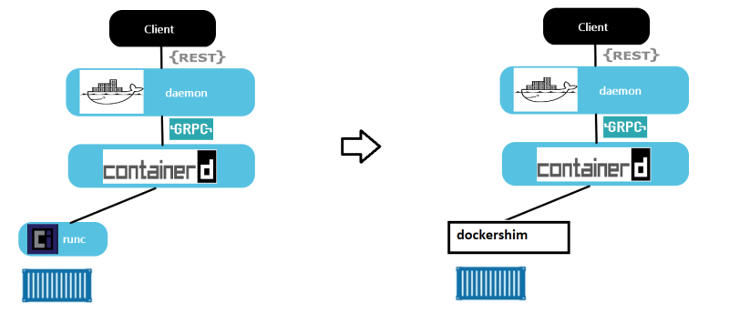
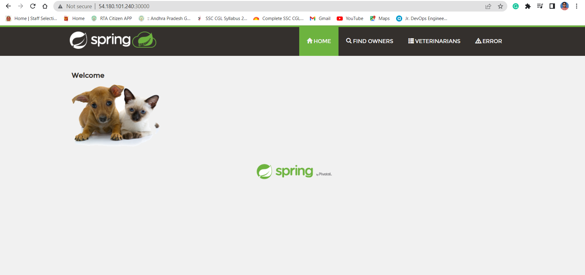
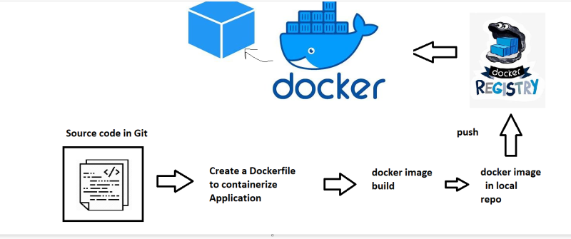
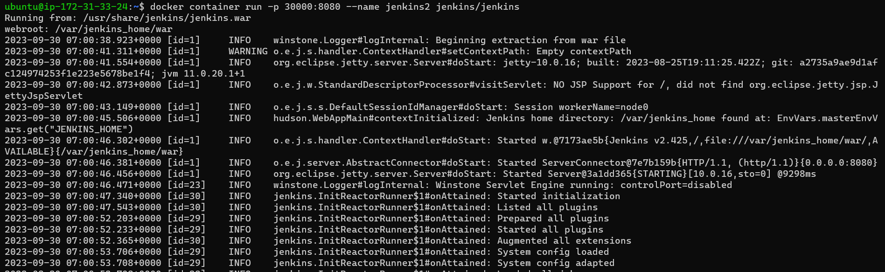
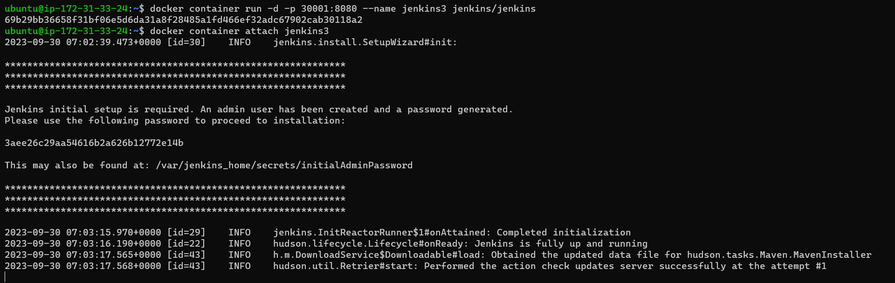
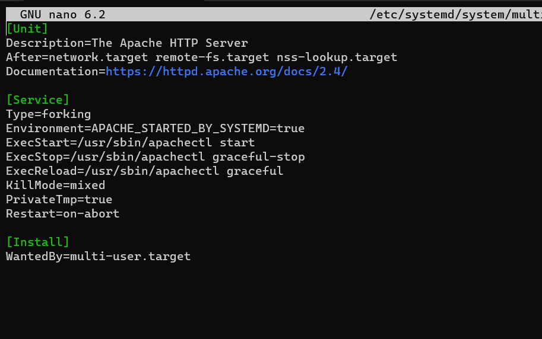
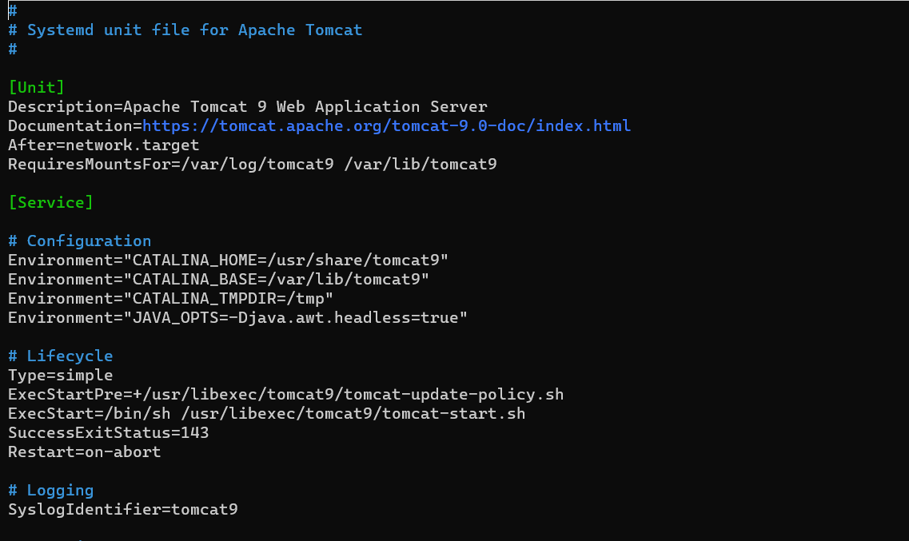
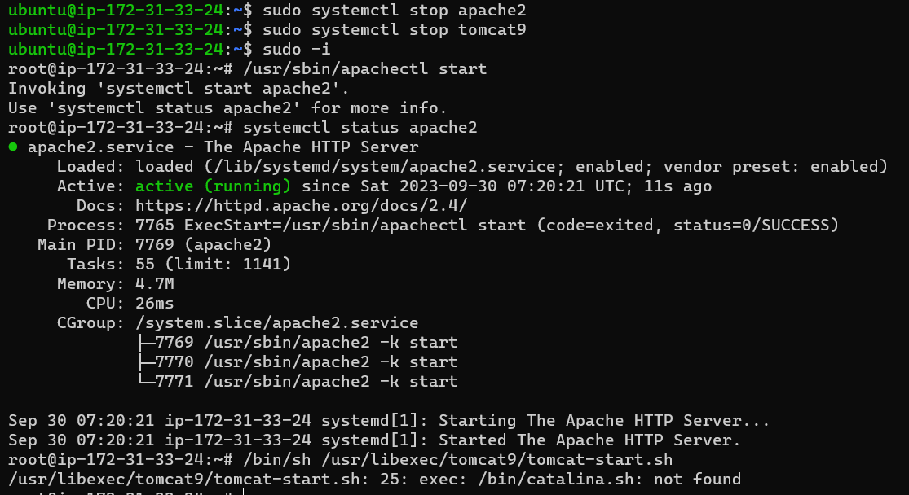
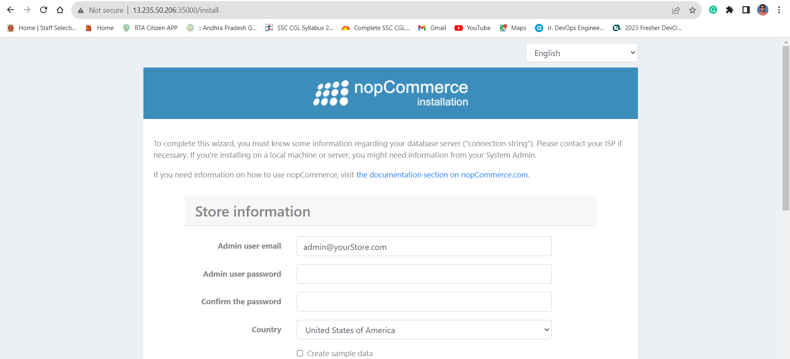

# Docker
* **Hypervisor:** A hypervisor, also known as a virtual machine monitor or VMM, is software that creates and runs virtual machines (VMs). A hypervisor allows one host computer to support multiple guest VMs by virtually sharing its resources, such as memory and processing.(Which creates VMs and install necessary softwares.)
*  **Container:** A container is an isolated environment for your code. This means that a container has no knowledge of your operating system, or your files. It runs on the environment provided to you by Docker Desktop. This is why a container usually has everything that your code needs in order to run, down to a base operating system.

### What is docker?
* Docker (dock worker) is used to create containers which is standard way of packaging any application
* Application can be any of the below but have a standard way of packaging i.e docker image.
   * developed in any technology
   * developed on any server
* Packaging in docker image format helps us to run our application.
  
### Expectations from you in terms of Docker
* Containerize any application run by your organization.
* Manage Data, Security and Networks for containerized applications.
* To acheive the above expectations, we need to use
* docker and understand how it runs and creates containers
    * play with docker aroud networks, data and security
    * apply them to our application. 

* When we install docker we get 2 components:
  
    **1.Docker Client:** A cmd line  to interact with docker.

    **2.Docker Engine:**  It contains multiple components.

    * Orchestration (Docker swarm): Running too many containers running in multiple machines.
    * Docker deamon: It conatins all the necessary components to communicate with docker.
    * Runtime: It speaks with operating system(OS) when docker gives a cmd to run.
* We can install docker using script [referhere](https://get.docker.com/)
* Docker allows communication to the unix socket for the users who belong to docker group. so lets add current user to docker group `sudo usermod -aG docker <username>`. logout and login into the machine.
* We can also use `sudo chmod 666 /var/run/docker.sock`. If we use this cmd there is no need to logout and login again.
* In docker playground to get full screen or back to normal `Alt+Enter`.
* **Docker Image** means Docker packaging formate.
* Docker way of working:
    * First we create a docker image by writting a Dockerfile.
    * Next we push that image to docker hub.
    * We can create a container using that image.
  
### Architecture of Docker:
  * Lastest architecture contains:
  * **docker daemon** exposes api’s to listen requests from docker client.
  * Passes the requests to **containerd**. This manages the lifecylcle of container   
  * **containerd** forks a runc process which creates container. 
  * once the container is created the parent of the container will be **docker shim**
  * Docker shim is a lite weight container which checks on images and report back to the Docker daemon. 
  
* ### What happens when we create a container:
* docker container creation:
* To create container we need some image in this case lets take `hello-world`.
* The command `docker container run hello-world` executed.
* What happens 
  * docker client will forward the request to docker daemon
  * docker daemon will check if the image exists locally. if yes creates the container by using image
  * if the image doesnot exist, then docker daemon tries to download the image from docker registry connected. The default docker registry is docker hub.
  * Downloading image into local repo from registy is called as pull.
  * Once the image is pulled the container is created.
* **Registry** is collection of docker images hosted for reuse.
### Pull the images from Docker Hub:
* Image naming convention.(from our docker hub account)
 ```
 [username]/[repository]:[<tag>]
 teju1811/myspc:1.0.1
 username => shaikkhajaibrahim 
 repository => what image => myspc
 tag => version => 1.0.1
 ```
* Default tag is latest which means if we didn't mention tag beside image name then lastest one will be downloaded.
* Offical images don't have username which means if we are using an offical image then there is no need to mention username. If we are using the image which is present in our account then we have to mention username like above.
* To pull an image with specific tag for example.
```
docker image pull nginx:1.23
docker image ls (for listof images)
```
### Remove images locally:
* Every image have image id and image name. We can delete the image individually by using command `docker image rm <imagename:tag>`.
* To remove all the images present at ones `docker image rm $(docker image ls -q)`.
### Create and Removing a container:
* To create and run a container we use ` docker container run -d <imagename:tag>`or ` docker container run --name <containername> -d <imagename:tag>`(every container gets an id and a name. name can be passed while creating container, if not docker will give random name)
* Remove all the running containers `docker container rm -f $(docker container ls -q )`
* Remove specific container `docker container rm <container name>`
* Remove all containers `docker container rm -f $(docker container ls -a -q )`
### **Docker Contianer Lifecycle:**
* Stages of docker container:
   1. Create
   2. Running
   3. Pause
   4. Stop
   5. Delete
* Command `docker container inspect <container name>` will give you information about the container.
* Command `docker image inspect <image name>` will give info about image.

Accessing Application inside Docker containers:
-------------------------------------------
* The machine where we have installed docker will referred as host and the docker container will be referred as container.
* We have access to host network & as of now containers are created in private container network, so to access applications inside containers we use port-forwording.
* command: `docker container run -d -p <host-port>:<App-port> <image>`
* To assing any random free port on host to container port` docker container run -d -P <image>`
* It is better to use **-P** than **-p**, because -P will assign random port number itself where there is no need to remember port numbers which were assigned where as by using -p we have to assign port number we can't remember the port numbers which were assigned we have to check so its better to use -P.

### Conainerizing an Application:
* Taken springpet clinic as sample application.
* Requires java 11 and runs on 8080 port.
* To run this application cmds are
```
docker container run -it -p 30000:8080 amazoncorretto:11 /bin/bash
```
* "-it" is used to log into the container created in an interative mode.
* After logging into the container run following commands.
 ```
 curl https://referenceapplicationskhaja.s3.us-west-2.amazonaws.com/spring-petclinic-2.4.2.jar -o spring-petclinic-2.4.2.jar
 ls
 java -jar spring-petclinic-2.4.2.jar
 ```
 
* We can create an image from running container using `docker container commit <container name> <newimage name:tag>`
* remove all the containers and run the myspc image based container.
* Then run this cmd `docker container run -d -p 30001:8080 --name spc1 myspc:latest java -jar spring-petclinic-2.4.2.jar`.
* This is not a useful approach as we are creating images manually.
* Docker has a better way to build an image i.e. **Dockerfile**
   
Dockerfile
----------

### Workflow:


* Dockerfile is a set of text instructions [referhere](https://docs.docker.com/engine/reference/builder/)
* In Docker we have concept of base image i.e. to run your application using some existing image.
* We can also  use a base image called as scratch which has nothing in it.
* We can give different tag for same image. It contains same image id. but two different tags>
### Basic Instructions:
**FROM:** The FROM instruction initializes a new build stage and sets the Base Image for subsequent instructions. As such, a valid Dockerfile must start with a FROM instruction. The image can be any valid image – it is especially easy to start by pulling an image from the Public Repositories.

**RUN:** The RUN instruction will execute any commands in a new layer on top of the current image and commit the results. The resulting committed image will be used for the next step in the Dockerfile.(The commands to be executed while building the image to install/configure your application)

**CMD:** This command will be executed while starting the container.

**EXPOSE:** This adds ports to be exposed while starting the container.

**LABEL:** This instruction adds metadata about application. It has no finctionally in Dockerfile.

**ADD:** ADD instruction can add the files into docker image from local file system as well as from http(s)
* ADD instruction can have sources
    * local file system
    * git repo
    * url

**COPY:** supports only local file system.
* copy the springpetclinic jar file into some local path on docker host.

**WORKDIR:** sets the directory where the instructions to be run.
* The WORKDIR instruction can be used multiple times

### Example-1: Basic Dockerfile
```Dockerfile
FROM amazoncorretto:11
# RUN is used to run a command here curl cmd is used
RUN curl https://referenceapplicationskhaja.s3.us-west-2.amazonaws.com/spring-petclinic-2.4.2.jar -o spring-petclinic-2.4.2.jar 
EXPOSE 8080
CMD ["java", "-jar", "/spring-petclinic-2.4.2.jar"]
```
### Example-2: Adding Label to the Dockerfile
```Dockerfile
FROM amazoncorretto:11
FROM amazoncorretto:11
LABEL author="Tejaswini"
LABEL organization="qt"
LABEL project="learning"
# RUN is used to run a command here curl cmd is used
RUN curl https://referenceapplicationskhaja.s3.us-west-2.amazonaws.com/spring-petclinic-2.4.2.jar -o spring-petclinic-2.4.2.jar 
EXPOSE 8080
CMD ["java", "-jar", "/spring-petclinic-2.4.2.jar"]
```
### Example-3: Using ADD 
```Dockerfile
FROM amazoncorretto:11
FROM amazoncorretto:11
LABEL author="Tejaswini"
LABEL organization="qt"
LABEL project="learning"
#ADD is used to copy the content which is present in internet and as well as from local machine
ADD https://referenceapplicationskhaja.s3.us-west-2.amazonaws.com/spring-petclinic-2.4.2.jar  /spring-petclinic-2.4.2.jar
EXPOSE 8080
CMD ["java", "-jar", "/spring-petclinic-2.4.2.jar"]
```
### Example-4: Using COPY 
```Dockerfile
FROM amazoncorretto:11
LABEL author="Tejaswini"
LABEL organization="qt"
LABEL project="learning"
# Copy from local file on Docker host into docker image
COPY spring-petclinic-2.4.2.jar  /spring-petclinic-2.4.2.jar
EXPOSE 8080
CMD ["java", "-jar", "/spring-petclinic-2.4.2.jar"]
```
### What do we mean by running container in detached mode?
* docker container’s STDOUT and STDERR will be attached to your terminal and if we execute ctrl+c the container exits.
* Running container normally will take us to attached mode.

* In detached mode container executes and gives us back the access to terminal.
* Once we start the container in detached mode we can still view the STDOUT and STDERR by executing docker container attach <container-name-or-id>.To exit from attach mode Ctrl+PQ

### Docker container will be in running state as long as command in cmd is running.
* Docker container will move to exited stated once the command in CMD has finished executing.
  
Exercise-1:
-----------
* Create a ubuntu vm
* install apache2 and note the ExecStart command for apache2.
    * nano /etc/systemd/system/multi-user.target.wants/apache2.service.
    * ExecStart=/usr/sbin/apachectl start
  
* install tomcat9 and note the ExecStart command for tomcat9.
    * nano /etc/systemd/system/multi-user.target.wants/tomcat9.service
    * /bin/sh /usr/libexec/tomcat9/tomcat-start.sh
   
* stop the services (systemcl stop servicename)
* become a root user (sudo -i)
* try executing the ExecStart command directly and see if the application is running.
  

### .Net Application(Nop Commerce)
* Manual steps : [Refer here](https://docs.nopcommerce.com/en/installation-and-upgrading/installing-nopcommerce/installing-on-linux.html)
* Run the application using command dotnet Nop.Web.dll --urls "http://0.0.0.0:5000" 
* For manual steps I have done following steps.
```bash
docker container run -it -p 35000:5000 --name nop mcr.microsoft.com/dotnet/sdk:7.0 /bin/bash
# After running above step you will login into the container and run below commands
wget https://github.com/nopSolutions/nopCommerce/releases/download/release-4.60.5/nopCommerce_4.60.5_NoSource_linux_x64.zip
apt-get install unzip
unzip nopCommerce_4.60.5_NoSource_linux_x64.zip
mkdir bin
mkdir logs
# run the below command to start the application
dotnet Nop.Web.dll --urls "http://0.0.0.0:5000" 
```


**Dockerfile for above application**

* [ReferHere]() for Dockerfile


