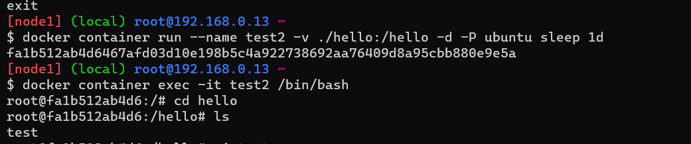
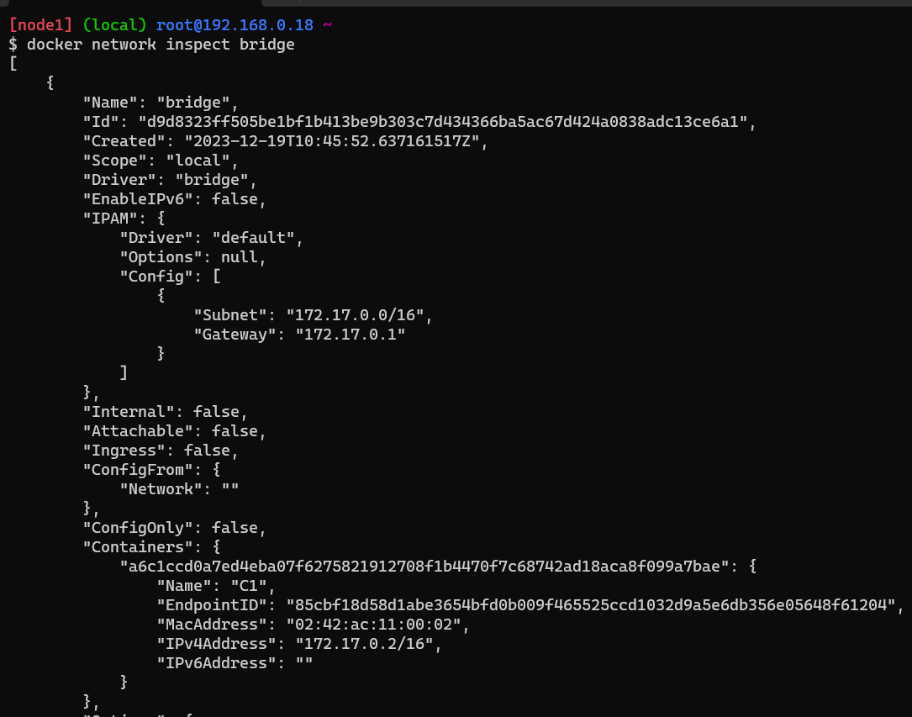
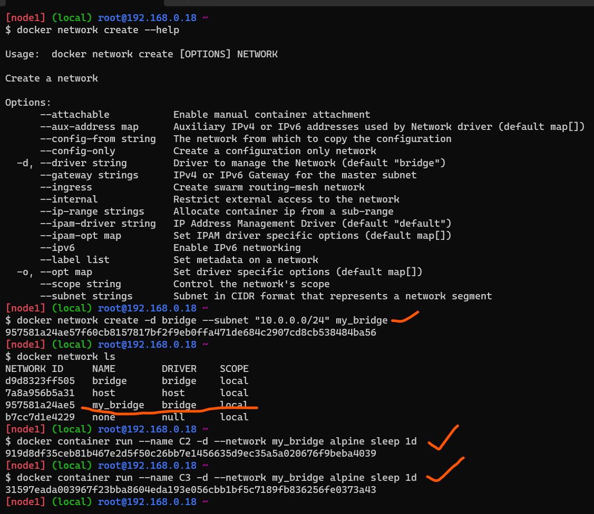
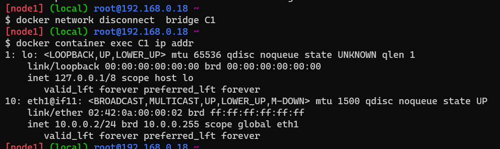

# Docker
* **Hypervisor:** A hypervisor, also known as a virtual machine monitor or VMM, is software that creates and runs virtual machines (VMs). A hypervisor allows one host computer to support multiple guest VMs by virtually sharing its resources, such as memory and processing.(Which creates VMs and install necessary softwares.)
*  **Container:** A container is an isolated environment for your code. This means that a container has no knowledge of your operating system, or your files. It runs on the environment provided to you by Docker Desktop. This is why a container usually has everything that your code needs in order to run, down to a base operating system.
  
Difference between containers and virtual machine
-------------------------------------------------

| Feature               | Containers                        | Virtual Machines                  |
|-----------------------|-----------------------------------|-----------------------------------|
| **Abstraction Level** | Operating System level            | Hardware level                    |
| **Resource Overhead** | Lower                             | Higher                            |
| **Isolation**         | Process-level                     | Stronger, with separate OS        |
| **Performance**       | Lower overhead, faster startup    | Higher overhead, slower startup   |
| **Portability**       | Highly portable                   | Less portable                     |
| **Use Cases**         | Microservices, CI/CD, scaling     | Legacy apps, specific OS needs    |

Difference between monolith and microservices
---------------------------------------------

| Feature                   | Monolithic Architecture          | Microservices Architecture      |
|---------------------------|----------------------------------|----------------------------------|
| **Structure**             | Single, tightly-coupled application | Decentralized, modular services   |
| **Development**           | Unified codebase                 | Distributed, independent services|
| **Scaling**               | Horizontal scaling of the entire app | Vertical or horizontal scaling of specific services |
| **Isolation**             | Limited, changes affect the entire app | High, changes impact specific services |
| **Technology Stack**      | Single, uniform technology stack | Diverse technology stacks for each service |
| **Deployment**            | Entire application is deployed at once | Services can be deployed independently |
| **Flexibility**           | Limited, all components must use the same technology | High, flexibility in choosing technologies for each service |
| **Fault Tolerance**       | A failure can affect the entire application | Failures are isolated to specific services, enhancing overall system resilience |
| **Communication**         | Direct method calls within the application | Inter-service communication often via APIs (HTTP/Message queues) |
| **Scalability**           | Limited scalability options for individual components | Flexible scalability for specific services based on demand |
| **Development Teams**     | Single development team           | Multiple, smaller teams can work on different services simultaneously |
| **Example Technologies**  | Java EE, .NET monolithic frameworks | Spring Boot, Node.js, Docker, Kubernetes for microservices |

How Isolations are created or How Containers Work
-------------------------------------------------
* Each container is getting a
  * new process tree 
  * disk mounts
  * network (nic)
  * cpu/memory
  * users
  
What is docker?
---------------
* Docker (dock worker) is used to create containers which is standard way of packaging any application
* Application can be any of the below but have a standard way of packaging i.e docker image.
   * developed in any technology
   * developed on any server
* Packaging in docker image format helps us to run our application.
* Docker Image contains all the neccessary files to run an application we want inside a container.
  
### Expectations from you in terms of Docker
* Containerize any application run by your organization.
* Manage Data, Security and Networks for containerized applications.
* To acheive the above expectations, we need to use
* docker and understand how it runs and creates containers
    * play with docker aroud networks, data and security
    * apply them to our application. 

* When we install docker we get 2 components:
  
    **1.Docker Client:** A cmd line  to interact with docker.

    **2.Docker Engine:**  It contains multiple components.

    * Orchestration (Docker swarm): Running too many containers running in multiple machines.
    * Docker deamon: It conatins all the necessary components to communicate with docker.
    * Runtime: It speaks with operating system(OS) when docker gives a cmd to run.
* We can install docker using script [referhere](https://get.docker.com/)
* Docker allows communication to the unix socket for the users who belong to docker group. so lets add current user to docker group `sudo usermod -aG docker <username>`. logout and login into the machine.
* We can also use `sudo chmod 666 /var/run/docker.sock`. If we use this cmd there is no need to logout and login again.
* In docker playground to get full screen or back to normal `Alt+Enter`.
* **Docker Image** means Docker packaging formate.
* Docker way of working:
    * First we create a docker image by writting a Dockerfile.
    * Next we push that image to docker hub.
    * We can create a container using that image.
  
### Architecture of Docker:
  * Lastest architecture contains:
  * **docker daemon** exposes api’s to listen requests from docker client.
  * Passes the requests to **containerd**. This manages the lifecylcle of container   
  * **containerd** forks a runc process which creates container. 
  * once the container is created the parent of the container will be **docker shim**
  * Docker shim is a lite weight container which checks on images and report back to the Docker daemon. 
  
* ### What happens when we create a container:
* docker container creation:
* To create container we need some image in this case lets take `hello-world`.
* The command `docker container run hello-world` executed.
* What happens 
  * docker client will forward the request to docker daemon
  * docker daemon will check if the image exists locally. if yes creates the container by using image
  * if the image doesnot exist, then docker daemon tries to download the image from docker registry connected. The default docker registry is docker hub.
  * Downloading image into local repo from registy is called as pull.
  * Once the image is pulled the container is created.
* **Registry** is collection of docker images hosted for reuse.
### Pull the images from Docker Hub:
* Image naming convention.(from our docker hub account)
 ```
 [username]/[repository]:[<tag>]
 teju1811/myspc:1.0.1
 username => shaikkhajaibrahim 
 repository => what image => myspc
 tag => version => 1.0.1
 ```
* Default tag is latest which means if we didn't mention tag beside image name then lastest one will be downloaded.
* Offical images don't have username which means if we are using an offical image then there is no need to mention username. If we are using the image which is present in our account then we have to mention username like above.
* To pull an image with specific tag for example.
```
docker image pull nginx:1.23
docker image ls (for listof images)
```
### Remove images locally:
* Every image have image id and image name. We can delete the image individually by using command `docker image rm <imagename:tag>`.
* To remove all the images present at ones `docker image rm $(docker image ls -q)`.
### Create and Removing a container:
* To create and run a container we use ` docker container run -d <imagename:tag>`or ` docker container run --name <containername> -d <imagename:tag>`(every container gets an id and a name. name can be passed while creating container, if not docker will give random name)
* Remove all the running containers `docker container rm -f $(docker container ls -q )`
* Remove specific container `docker container rm <container name>`
* Remove all containers `docker container rm -f $(docker container ls -a -q )`
### **Docker Contianer Lifecycle:**
* Stages of docker container:
   1. Create
   2. Running
   3. Pause
   4. Stop
   5. Delete
* Command `docker container inspect <container name>` will give you information about the container.
* Command `docker image inspect <image name>` will give info about image.
* When the container is created, each container gets its own
  * network ip address
  * RAM
  * filesystem
  * CPU share
* Execute `docker stats` to know the cpu/RAM utilization
### Exploring container 
* On the docker host(linux) execute the folowing commands
   * list all the process `ps` or `ps aux`
   * get the ip address `ip addr` or `ifconfig` (10.2.0.4)
   * Explore storage `df -h` & `lsblk`

Accessing Application inside Docker containers:
-----------------------------------------------
* The machine where we have installed docker will referred as host and the docker container will be referred as container.
* We have access to host network & as of now containers are created in private container network, so to access applications inside containers we use port-forwording.
* command: `docker container run -d -p <host-port>:<App-port> <image>`
* To assing any random free port on host to container port` docker container run -d -P <image>`
* It is better to use **-P** than **-p**, because -P will assign random port number itself where there is no need to remember port numbers which were assigned where as by using -p we have to assign port number we can't remember the port numbers which were assigned we have to check so its better to use -P.

### Conainerizing an Application:
* Taken springpet clinic as sample application.
* Requires java 11 and runs on 8080 port.
* To run this application cmds are
```
docker container run -it -p 30000:8080 amazoncorretto:11 /bin/bash
```
* "-it" is used to log into the container created in an interative mode.
* After logging into the container run following commands.
 ```
 curl https://referenceapplicationskhaja.s3.us-west-2.amazonaws.com/spring-petclinic-2.4.2.jar -o spring-petclinic-2.4.2.jar
 ls
 java -jar spring-petclinic-2.4.2.jar
 ```
 
* We can create an image from running container using `docker container commit <container name> <newimage name:tag>`. This approach creates images but no history of changes are available.
* remove all the containers and run the myspc image based container.
* Then run this cmd `docker container run -d -p 30001:8080 --name spc1 myspc:latest java -jar spring-petclinic-2.4.2.jar`.
* This is not a useful approach as we are creating images manually.
* Docker has a better way to build an image i.e. **Dockerfile**
   
Dockerfile
----------

### Workflow:


* Dockerfile is a set of text instructions [referhere](https://docs.docker.com/engine/reference/builder/)
* In Docker we have concept of base image i.e. to run your application using some existing image.
* We can also  use a base image called as scratch which has nothing in it.
* We can give different tag for same image. It contains same image id. but two different tags>
### Basic Instructions:
**FROM:** The FROM instruction initializes a new build stage and sets the Base Image for subsequent instructions. As such, a valid Dockerfile must start with a FROM instruction. The image can be any valid image – it is especially easy to start by pulling an image from the Public Repositories.

**RUN:** The RUN instruction will execute any commands in a new layer on top of the current image and commit the results. The resulting committed image will be used for the next step in the Dockerfile.(The commands to be executed while building the image to install/configure your application)

**CMD:** This command will be executed while starting the container. If we don't write CMD in dockerfile it will take CMD of base image.

**EXPOSE:** This adds ports to be exposed while starting the container.

**LABEL:** This instruction adds metadata about application. It has no finctionally in Dockerfile.

**ADD:** ADD instruction can add the files into docker image from local file system as well as from http(s)
* ADD instruction can have sources
    * local file system
    * git repo
    * url

**COPY:** supports only local file system.
* copy the springpetclinic jar file into some local path on docker host.

**WORKDIR:** sets the directory where the instructions to be run.
* The WORKDIR instruction can be used multiple times

### Example-1: Basic Dockerfile
```Dockerfile
FROM amazoncorretto:11
# RUN is used to run a command here curl cmd is used
RUN curl https://referenceapplicationskhaja.s3.us-west-2.amazonaws.com/spring-petclinic-2.4.2.jar -o spring-petclinic-2.4.2.jar 
EXPOSE 8080
CMD ["java", "-jar", "/spring-petclinic-2.4.2.jar"]
```
### Example-2: Adding Label to the Dockerfile
```Dockerfile
FROM amazoncorretto:11
LABEL author="Tejaswini"
LABEL organization="qt"
LABEL project="learning"
# RUN is used to run a command here curl cmd is used
RUN curl https://referenceapplicationskhaja.s3.us-west-2.amazonaws.com/spring-petclinic-2.4.2.jar -o spring-petclinic-2.4.2.jar 
EXPOSE 8080
CMD ["java", "-jar", "/spring-petclinic-2.4.2.jar"]
```
### Example-3: Using ADD 
```Dockerfile
FROM amazoncorretto:11
LABEL author="Tejaswini"
LABEL organization="qt"
LABEL project="learning"
#ADD is used to copy the content which is present in internet and as well as from local machine
ADD https://referenceapplicationskhaja.s3.us-west-2.amazonaws.com/spring-petclinic-2.4.2.jar  /spring-petclinic-2.4.2.jar
EXPOSE 8080
CMD ["java", "-jar", "/spring-petclinic-2.4.2.jar"]
```
### Example-4: Using COPY 
```Dockerfile
FROM amazoncorretto:11
LABEL author="Tejaswini"
LABEL organization="qt"
LABEL project="learning"
# Copy from local file on Docker host into docker image
COPY spring-petclinic-2.4.2.jar  /spring-petclinic-2.4.2.jar
EXPOSE 8080
CMD ["java", "-jar", "/spring-petclinic-2.4.2.jar"]
```
### What do we mean by running container in detached mode?
* docker container’s STDOUT and STDERR will be attached to your terminal and if we execute ctrl+c the container exits.
* Running container normally will take us to attached mode.

* In detached mode container executes and gives us back the access to terminal.
* Once we start the container in detached mode we can still view the STDOUT and STDERR by executing docker container attach <container-name-or-id>.To exit from attach mode Ctrl+PQ

### Docker container will be in running state as long as command in cmd is running.
* Docker container will move to exited stated once the command in CMD has finished executing.
  
### Exercise-1:

* Create a ubuntu vm
* install apache2 and note the ExecStart command for apache2.
    * nano /etc/systemd/system/multi-user.target.wants/apache2.service.
    * ExecStart=/usr/sbin/apachectl start
  
* install tomcat9 and note the ExecStart command for tomcat9.
    * nano /etc/systemd/system/multi-user.target.wants/tomcat9.service
    * /bin/sh /usr/libexec/tomcat9/tomcat-start.sh
   
* stop the services (systemcl stop servicename)
* become a root user (sudo -i)
* try executing the ExecStart command directly and see if the application is running.
  

### .Net Application(Nop Commerce)
* Manual steps : [Refer here](https://docs.nopcommerce.com/en/installation-and-upgrading/installing-nopcommerce/installing-on-linux.html)
* Run the application using command dotnet Nop.Web.dll --urls "http://0.0.0.0:5000" 
* For manual steps I have done following steps.
```bash
docker container run -it -p 35000:5000 --name nop mcr.microsoft.com/dotnet/sdk:7.0 /bin/bash
# After running above step you will login into the container and run below commands
wget https://github.com/nopSolutions/nopCommerce/releases/download/release-4.60.5/nopCommerce_4.60.5_NoSource_linux_x64.zip
apt-get install unzip
unzip nopCommerce_4.60.5_NoSource_linux_x64.zip
mkdir bin
mkdir logs
# run the below command to start the application
dotnet Nop.Web.dll --urls "http://0.0.0.0:5000" 
```


**Dockerfile for above application**

* [Refer Here](https://github.com/tejaswini1811/Docker/commit/9f7b716f9984adf39ab4b98eed9be2a8320a20ee) for Dockerfile

* [Refer Here](https://andrewlock.net/5-ways-to-set-the-urls-for-an-aspnetcore-app/) the document to host the .net application on 0.0.0.0

### Setting Environment Variables in the container
**ENV:** this will set the environmental variable in container. We can also change the env while creating the container.
* This instruction adds environmental variable in the container and it also allows us to change environmental variables while creating containers
* [Refer Here](https://github.com/tejaswini1811/Docker/commit/855f9be41aa9411a89d1fdb4ed1051844454e88d) for the changes done to include environmental varibles
* docker container exec will allow us to execute commands in the container.

* `docker container exec -it <c-name> <shell>` will allow us to login into container.

* ENV can be changed while creating the Container.
`docker conatiner run -e <env-name>=<newvalue> -d -P <imagename> `

**ARG:** ARG instruction allows us to set the values while building the image.
* Build args can be set while creating images. BUILD ARG can be used by using `${ARG_NAME}`.
* [Refer Here](https://github.com/tejaswini1811/Docker/commit/f78e169213c1d8756ef0cd574f7f2cf1d972a5c5) for Dockerfile adding ARG.
* We have build two images by changing the HOME_DIR and DOWNLOAD_URL Build args
```
docker image build --build-arg DOWNLOAD_URL=nopCommerce_4.60.2_NoSource_linux_x64.zip -t nop:1.0.2 .
docker image build --build-arg HOME_DIR=/publish -t nop:1.0.0 . 
```
* It is not a good idea to run the container as root user(for security issues) so we have to create a user and switch to that user.
  
**ENTRYPOINT:** Entrypoint and CMD does the same but command passed in CMD can be changed while creating the container but entrypoint can't be changed.
* CMD can be overwrite easily where as overwriting ENTRYPOINT  requires an extra argument --entryponit while creating the container.
* Docker will check the ENTRYPOINT and CMD. If entrypoint is present then cmd is argument for enrtypoint.

**USER:** The USER instruction sets the user name (or UID) and optionally the user group (or GID) to use as the default user and group for the remainder of the current stage. The specified user is used for RUN instructions and at runtime, runs the relevant ENTRYPOINT and CMD commands.
* [Refer Here](https://github.com/tejaswini1811/Docker/commit/50fb43dda46468017a389b388fd60b9ab51d5321) for Dockerfile using user.

* We can create docker image, by giving Dockerfile we can give other name to Dockerfile and create an image by using the command `docker image build -t <imagename> -f <dockerfilename> .`

#### Entrypoint and CMD
* Lets create two docker images
* Image Nmae: first
```Dockerfile
FROM alpine
CMD ["sleep", "1d"]
```
* Create a container with `docker container run first ping -c 4 google.com`
  
* Image Name: second
```Dockerfile
FROM alpine
ENTRYPOINT ["sleep"]
CMD ["1d"]
```
* We can override the entrypoint by passing an argument while creating a docker container`docker conatiner run --entrypoint <instruction> <image name> <command>`. The command i have given is `docker container run  --entrypoint ping second -c 1 google.com`


  
Image layer
-----------
* Docker images have read only layers when container is created using images then readyand write layer will be added.
* [Refer Here](https://directdevops.blog/2023/04/15/devops-classroomnotes-15-apr-2023/) for detailed explanation of image layers.
* Docker image is collection of layers and some metadata
* Docker image gets first set of layers from base image
* Any Additional changes w.r.t ADD/COPY creates extra layers
* Each RUN instruction which needs some storage creates layer
* It is recommended to use Multiple commands in RUN instruction rather than multiple RUN instructions as this leads to too many layers
* Docker has a filesystem which is aware of layers
  * overlay2
  
### Container and layers
* When a container gets created all the effective read-only image layers are mounted as disk to the container
* Docker creates a thin read write layer for each container.
* Any changes made by container will be stored in this layer
* Problem: when we delete container read write layer will be deleted.
* [Refer Here](https://directdevops.blog/2019/09/26/docker-image-creation-and-docker-image-layers/) for the article on layers
* [Refer Here](https://directdevops.blog/2019/09/27/impact-of-image-layers-on-docker-containers-storage-drivers/) for layers and storage Drivers.
  
### Stateful Appplications and Stateless Applications
* Stateful applications use local storage to store any state
* Stateless applications use external systems (database, blobstorage etc) to store the state
* We need not do anything special if your application is stateless in terms of writable layer, but if it stateful we need to preserve the state.
  
Docker Volumes
--------------
### Solving the Problem with Writable Layers
* Lets create a mysql container 
command
```
docker container run -d --name mysqldb -e MYSQL_ROOT_PASSWORD=rootroot -e MYSQL_DATABASE=employees -e MYSQL_USER=qtdevops -e MYSQL_PASSWORD=rootroot -P mysql:8
```

* To login into container
 ```
 docker container exec -it mysqldb mysql --password=rootroot
 ```
* To create a table
```
  use employees;
  CREATE TABLE Persons (
      PersonID int,
      LastName varchar(255),
      FirstName varchar(255),
      Address varchar(255),
      City varchar(255)
  );
  Insert into Persons Values (1,'test','test', 'test', 'test');
  Select * from Persons;
```

* Now if we remove the container we loose the data
* To fix the problem with data losses, Docker has volumes.
* Volume can exist even after docker container is deleted.
* We can attach volumes to other containers as well
* For this volume to work, we need to know the folder of which data will be preserved
* Let explore docker volume subcommand.
* docker volume creates a storage according to the driver specified. The default driver is local i.e. the volume is created in the machine where docker is executing. 
* Created a volume with `docker volume create <volumename>`

* Now deleted the previous container and create the a container attaching volume with is given to previous container.


**Experiment**
* Create a mysql container
* list all the volumes
* inspect all the volumes
* create volume docker volume create myvol
* inspect myvol
* Figure out locations of volumes in your local systems.


**KeyPoints**

* Always ensure volumes are automatically created for the stateful applications as part of Dockerfile (VOLUME instruction)
* Volumes are of two types
  * Explicity created (docker volume create myvol)
  * automatically created as part of container creation
* Ensure we have knowledge on necessary folders where the data is stored and use volumes for it.

* [Refer Here](https://directdevops.blog/2023/04/15/devops-classroomnotes-15-apr-2023-2/) for class notes.

### Persisting Data using Volumes
* Lets create an explicit volume for mysqldb
* Lets use volume type to mount the mysqldb
* Lets mount a volume using -v [Refer Here](https://docs.docker.com/storage/volumes/#start-a-container-with-a-volume) for official docs
* Create a mysql container.
```
docker container run -d --name mysqldb -v mysqldb:/var/lib/mysql -P -e MYSQL_ROOT_PASSWORD=rootroot -e MYSQL_DATABASE=employees -e MYSQL_USER=qtdevops -e MYSQL_PASSWORD=rootroot mysql
```

* now delete the container
* Now create a new container using mount
```
docker container run -d --name mysqldb --mount "source=mysqldb,target=/var/lib/mysql,type=volume" -P -e MYSQL_ROOT_PASSWORD=rootroot -e MYSQL_DATABASE=employees -e MYSQL_USER=qtdevops -e MYSQL_PASSWORD=rootroot mysql
```
* As we can see the data is persisted and is attached to new container.
* Lets use bindmount to mount ./hello on docker host to the container /hello
  
  

### Creating volume as part of Dockerfile
**Gameoflife:**
```Dockerfile
FROM tomcat:9.0.84-jre8
LABEL Author=Tejaswini
ARG GOL_URL=https://referenceapplicationskhaja.s3.us-west-2.amazonaws.com/gameoflife.war
ADD ${GOL_URL} /usr/local/tomcat/webapps/gameoflife.war
VOLUME [ "/usr/local/tomcat" ]
EXPOSE 8080
#CMD is not mentioned so CMD of base image will be taken
```


Docker Network
--------------
### Experiment
* Create a alpine container with the following names
```
docker container run -d --name C1 alpine sleep 1d
docker container run -d --name C2 alpine sleep 1d
```
* Now run in C1 ping C2 (docker container exec C1 ping C2)
* Findout ip addresses of C1 container and C2 container by executing
```
docker container inspect C1
docker container inspect C2
```
* Now login into C1 and ping C2 by using its ipaddress
* Observation Results
  * ping by name is not working
  
  * ping by ip is working
  

* Create an ubunutu linux vm
* install net-tools
```
sudo apt update && sudo apt install net-tools -y
ifconfig
```

*  Now install docker and check network interfaces again ifconfig

* A docker0 network interface is added.
* [Refer Here](https://directdevops.blog/2019/10/05/docker-networking-series-i/) for detailed explanation on docker network drivers.

### Docker Native Network Drivers
 1. Host: Container uses the networking stack of the host.
 2. Bridge: Creates a bridge on the host that is managed by Docker.All containers on Bridge Driver can communicate among themselves. Default Driver
 3. Overlay: Used for multi-host networks.
 4. MACVLAN: uses Linux MACVLAN bridge to establish connection b/w container interfaces & parent host interfaces. MAC address can be attached to each container.
   
### Docker Networking Scopes
* Local: provides connectivity within host
* Swarm: provides connectivity across swarm cluster
  
### Host Network Driver
* In host network driver all the containers are in same network namespace(sandbox)
  

### Bridge Network Driver
**Default Bridge Network Driver**


**User-Defined Bridge Networks**

* **Bridge:**
  * Default bridge will not have dns enabled (this is why in the above experiment C1 was not able to ping C2 by name)
* Create a container C1 in default network `docker container run -d --name C1 alpine sleep 1d`

* Default netwowrks when we install docker we get.


* inspect default bridge network `docker network inspect bridge`

* Lets create a new bridge network. After that create two contianers C2 and C3 in my_bridge network

* Inspect my_bridge network.


* Lets try ping from c2 to c3 by name. In default bridge network we can't ping containers with names but user-defined bridge networks we can ping by names as well as ip address.

* Connect container C1 to my_bridge network
```
docker container exec C1 ip addr
docker network connect my_bridge C1
docker container exec C1 ip addr
docker network disconnect bridge C1
docker container exec C1 ip addr
```



**Exercise**
* Lets create a mysql container in my_bridge network
  ```
  docker container run -d --name mysqldb -v mysqldb:/var/lib/mysql -P -e MYSQL_ROOT_PASSWORD=rootroot -e MYSQL_DATABASE=employees -e MYSQL_USER=qtdevops --network my_bridge mysql
  ```
* Lets run phpmyadmin
```
docker container run --name phpmyadmin --network my_bridge -d -e PMA_HOST=mysqldb -P phpmyadmin

``` 


* Above when creating phpmyadmin container we mention pma host as containere name of mysqldb and both the containers are connected because both belongs to user-defined bridge network.

### Multi Stage Docker build
* Multi staged build is used to build the code and copy necessary files into the final stage which will be your image
* By using multi stage we can reduce the sixe of our docker image.
* Example for multistage dockerfile [Refer here](https://github.com/tejaswini1811/Docker/blob/main/spring-petclinic/Dockerfile)

### Pushing images to Registries
1. Public Repository: Docker Hub is mostly used. 1 private repository is given free but we can use multiple by buying.
  
* Login into your Docker account.
  
  
  

2. Private Repository: examples areECR(Elastic Container Repository), ACR(Azure Container Repository), JFrog.
  
  
  

Understanding Multi-Host Networking
----------------------------------------
* Multi-host networking is created as part of docker orchestration called as SWARM
Refer Here for multi host networking.
* According to what we have learnt so far. Communication between containers in same host is possible using bridge or macvlan etc. but communication between two containers running on two different hosts is not possible.
  

* Docker has a netwok driver called as overlay network
Using vxlan, overlay networks use underlay to create a virtual network which is logical and appears as if the containers across hosts are connected to the same network.


* To create multi host network, we need to create docker swarm cluster.
* Swarm cluster provides native docker container orchestration.
* Some of the activities the cluster performs
   * Maintains the desired state.
   * Performs scaling
   * chooses the master node (manager)
   * ability to add docker hosts to the cluster 
   
* Setting the Cluster
* There are two kinds of nodes
  * **Manager nodes:** 
      * You communicate to manager node to deploy applications in the form of Service Definitions.
      * Manager nodes dispatch unit of work called as tasks to the Worker ndoes 
  * **Worker nodes:**
      * They receive & execute the tasks dispatched from manager nodes.
      * An agent runs on the worker node & reports on the tasks assigned to it


* [Refer Here](https://directdevops.blog/2019/10/07/docker-swarm-mode/) for more details.

A Sample Application
--------------------
* Python based application:
   * Web application
   * Database
* What is that I did
   * Create a bridge network
   * Create a volume and attach it to mysql container
   * Resolve the mysql container by its name
 ```bash 
  git clone https://github.com/DevProjectsForDevOps/StudentCoursesRestAPI.git
  cd StudentCoursesRestAPI
  docker image build -t scr:latest
  docker network create -d bridge scr_bridge
  docker volume create scr_db
  docker container run -d --name mysql -e MYSQL_ROOT_PASSWORD=password -e MYSQL_DATABASE=test -e MYSQL_USER=directdevops -e MYSQL_PASSWORD=directdevops --network scr_bridge -v scr_db:/var/lib/mysql mysql:5.6
  docker container run -d --name mypythonapp -e MYSQL_SERVER=mysql --network scr_bridge -P scr:latest
```
* We can do the above thing using docker compose file.
* 